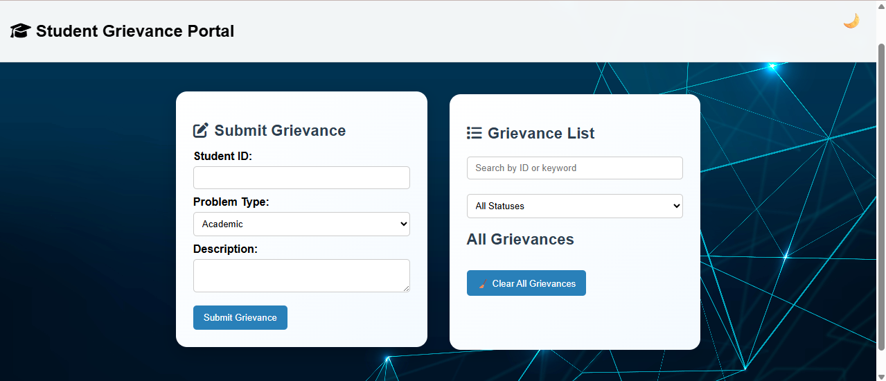

# 🎓 Student Grievance Portal

A sleek, user-friendly grievance management system for students — developed using **HTML, CSS, and JavaScript**. This portal enables students to seamlessly submit, view, and manage grievances, while also supporting theme toggles, responsive layout, and persistent local storage.

---

## 📌 Overview

The **Student Grievance Portal** is designed to make the process of raising and tracking grievances smooth and transparent. Students can submit complaints related to academics, infrastructure, or personal concerns, and track them by status. This project provides a front-end-only simulation suitable for demonstration, college projects, or small institutional use.

---

## 🔑 Key Features

### 📝 Grievance Handling
- Submit grievances with **Student ID**, **Category**, and **Description**.
- Auto-generates **Timestamp** and tracks the **status** (Pending/Resolved).
- **Prevents duplicate entries** using client-side validation.

### 🔎 Filter & Search
- Real-time **search** by Student ID or keywords in the description.
- **Filter** grievances by status (`All`, `Pending`, `Resolved`).

### 🌓 Theme Toggle
- Toggle between **Light** and **Dark** modes.
- Theme preference is remembered using `localStorage`.

### 🔔 Toast Notifications
- Friendly toast-style popups confirm:
  - Grievance submission
  - Duplicate warnings
  - Resolved status updates
  - Deletion confirmations

### 🧊 UI & Styling
- **Frosted Glass Card Effect** with subtle shadows and gradients.
- Modern, clean layout suitable for both desktop and mobile views.

### 💾 Data Persistence
- Grievances are stored in **`localStorage`** to maintain state across sessions.

### ❌ Management Actions
- **Mark as Resolved** – Changes status of individual grievances.
- **Delete Individual Grievance**
- **Clear All** – Deletes all grievances after user confirmation.

---

## 🎯 Use Cases

- Internal college projects or hackathons.
- Prototypes for grievance redressal systems in schools, colleges, or training centers.
- Practice project for web development beginners learning DOM manipulation and localStorage.

---

## ⚙️ Technologies Used

- **HTML5** – Structure and layout.
- **CSS3** – Visual design with gradients, glassmorphism, and responsiveness.
- **JavaScript (Vanilla)** – Logic, interactivity, and localStorage integration.
- **LocalStorage API** – Client-side data persistence.

---

## 📱 Responsiveness & Compatibility

- 📲 Fully responsive on various screen sizes including mobiles and tablets.
- 🧪 Cross-browser tested on Chrome, Firefox, and Edge.

---

## 🌱 Future Enhancements

- ✅ Admin/faculty login with moderation access.
- ✅ Backend integration (Node.js / Firebase / Python Flask).
- ✅ Grievance categories with icons and color labels.
- ✅ Export grievances as PDF or Excel.
- ✅ Notification badges for unresolved issues.

---

## 🚀 Getting Started

1. Clone or download this repository.
2. Open `index.html` in a browser.
3. Submit and manage grievances right from your local machine.

> No backend or database setup required — everything runs in the browser.

---

## 📜 License

MIT License – open for learning and customization.

---

## 👩‍💻 Author

Developed by **Chandrika Amara**  
Feel free to connect or suggest improvements.

